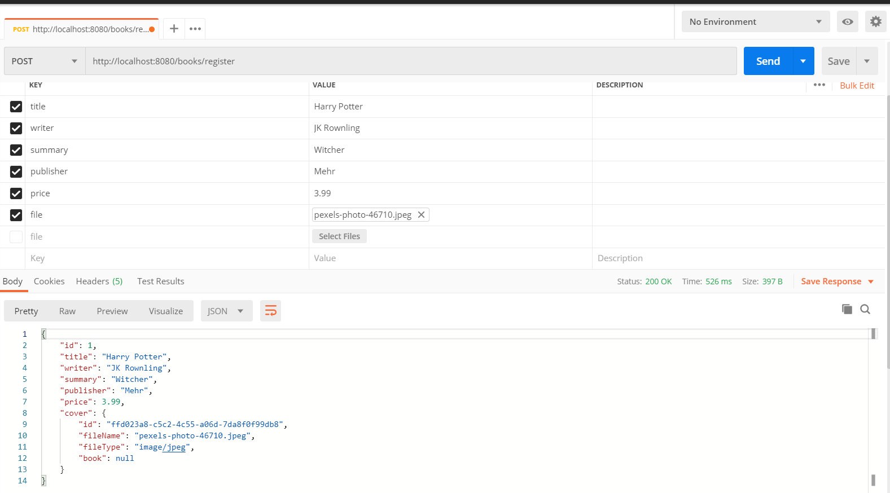

# Spring-Boot-File-Upload-Downlado-Rest-Api
A Library where each book has a cover(File) which can be downloaded
 
 
 

### Set up
1. Set application.properties
     Open src/main/java/resourcers/application.properties
     Create a MySQL database called  **_spring_boot_file_** 
      spring.datasource.username= YOUR MYSQL USERNAME
         spring.datasource.password= YOUR MYSQL PASSWORD
   

2. run the app

### Links

1. http://localhost:8080/books/register
     Use this Link to create a new book
    
2. http://localhost:8080/books/getall
     Use this Link to get all books stored
    
3. http://localhost:8080/books/delete/book_id
     Use this Link to delete book 
    
4. http://localhost:8080/books/get/book_id
     Use this Link to get book with given book_id
    
5. http://localhost:8080/books/file/book_id
     Use this Link to download file(cover) book
     

### How To Register with postman

